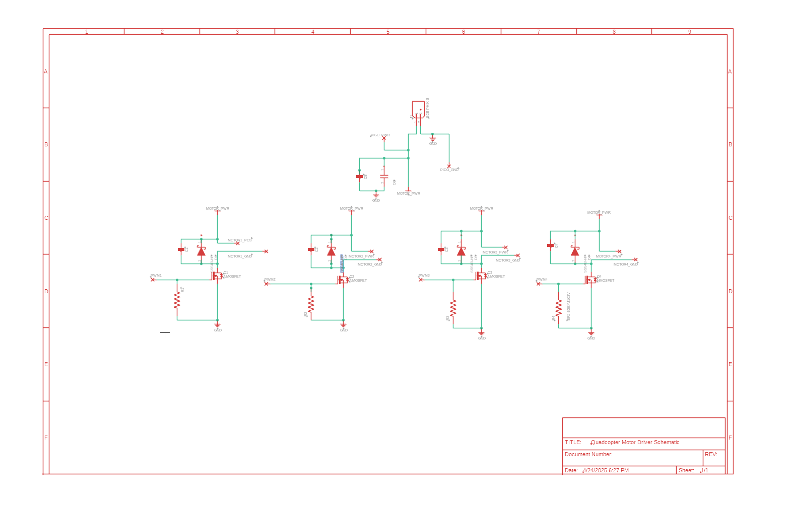
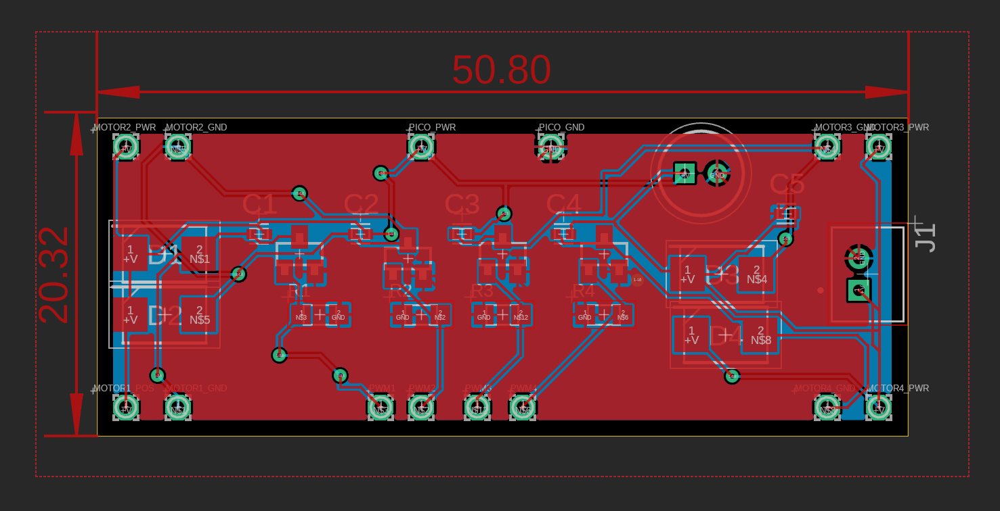
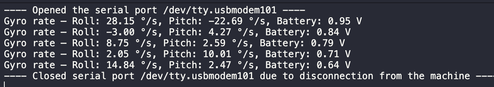
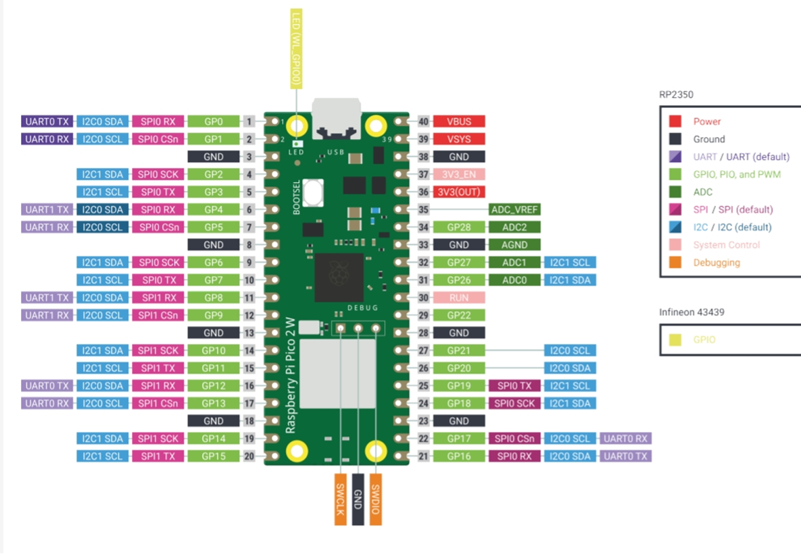
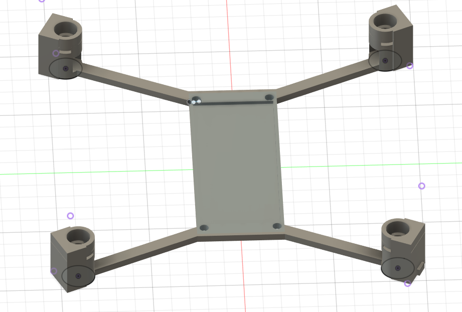
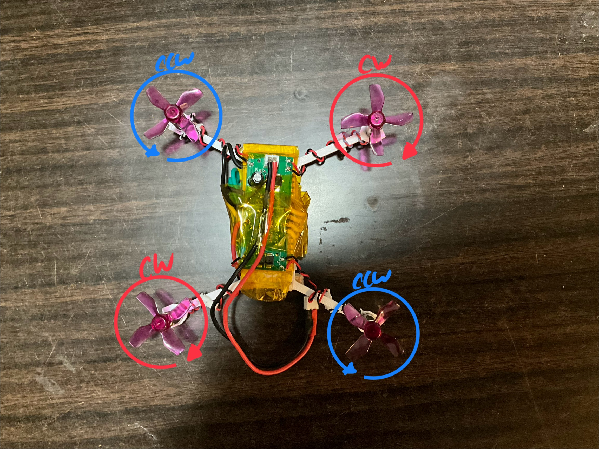

<h1 align="center">ECE 5780 - Quadcopter</h1>

Quadcopter Team Members:
<ul style="list-style-position: inside;">
  <li>Rudis Argueta</li>
  <li>Donggeon Kim </li>
  <li>Taehoon Kim</li>
  <li>Luke Stillings </li>
</ul>

___

  

Figure 1. GIF Of The Drone Hovering

  

---

## Project Summary
A quadcopter that can only hover made using the Raspberry Pi Pico 2 W, a motor driver, BetaFPV motors, and a MPU6050. 

**How It Works:**
To create a quadcopter using the Raspberry Pi Pico 2W we had to create a motor driver that will power the motors by using a battery, and the PWM signals coming from the Raspberry Pi Pico 2W. The PWM signals control the speed of the motors, and to do this we used a MOSFET that has a low threshold voltage because the max voltage the Pico's PWM will be is 3.3V. Additionally, we used a MPU6050 to grab x, and y information, and with this information we created a PID loop that will attempt to keep the quadcopter at a 0° roll, and pitch rate. Additionally, the frame and drone was assembled by us. 

---

## System Architecture

1. **Power**  
   - 1s LiPo battery -> Power 4x BetaFPV Motors  
   - USB Connection Powers Raspberry Pi Pico 2 W 

2. **Sensing**  
   - MPU6050 → I²C (GPIO 26/27)  
   - Data-ready interrupt (GPIO 22) 

3. **Control**  
   - PID loop 
   - PWM on four channels (GPIO 6–9)
   - Data over serial USB
   - Onboard LED blink marks start/end of each loop  

---

## Development Milestones

### Milestone 1  
- Proto-PCB built to verify MOSFET motor-driver circuit  
- Final PCB layout completed (Pico, MOSFETs, IMU)  
- Component selection and documentation finalized

Figure 2. Schematic Diagram of the Motor Driver Circuit

Figure 3. Final PCB Layout of our Motor Driver that will control the drone Motors

  

### Milestone 2  
- Assembled & tested PCB + 3D-printed frame  
- Verified PWM control (0 %→75 % duty) and MOSFET switching  
- Eliminated a board-short by redesigning mount  

### Milestone 3  
- I²C MPU6050 integration with drift calibration  
- ADC-based battery monitoring  
- Full system flight test

Figure 4. USB Serial Output of Roll Rate, Pitch Rate, and Current Battery Voltage.

  

### Milestone 4
- Demonstation
[Click here to see full demo video](videos_images/IMG_0630.MOV)

---

## Hardware Details

### How Everything is Wired:

The following is how everything is wired together and Figure 4. shows the pinout diagram for the Raspberry Pi Pico 2 W.

Figure 5. 3D rendering of drone frame made in Fusion 360

#### HiLetGo MPU6050 Connections to Raspberry Pi Pico 2W 
         VCC -> VBUS
         SDA -> I2C1 SCL
         SCL -> I2C1 SDA
         GND -> GND
         INT -> GP22
     

#### Raspberry Pi Pico 2W connections to Motor Driver PCB
         GP6 -> Motor Drive Motor 1 
         GP7 -> Motor Drive Motor 2
         GP8 -> Motor Drive Motor 3   
         GP9 -> Motor Drive Motor 4
         GND -> GND

#### Voltage Divider Connections to Motor Driver and Raspberry Pi Pico 2W
         VCC -> PWR
         GND -> GND
         Divider Output -> GP28

### Frame & How It Was Made

Figure 5. showcases the first iteration of our drone frame. The second iteration of our frame had the motor holders removed to reduce the weight, and motors were super glued to the frame. 
Also, the HiLetGo MPU6050 was glued to the frame aswell. Between the Raspberry Pi Pico and motor driver, a wood plate was added to prevent short. Lastly, the battery was placed at the bottom bed of the drone and zipped tied. All components were wrapped around by kapton tape to be secured and prevent any shorts when testing/flying.

Figure 6. 3D rendering of drone frame made in Fusion 360

Figure 7. Image of the fully completed drone 

**Motor Spin Direction and Wiring Colors:**
- **Clockwise (CW)**: Motors with **Red and Blue** wires (top left and bottom right)
- **Counterclockwise (CCW)**: Motors with **White and Black** wires (top right and bottom left)

### Component List:
Main:
- 1x Raspberry Pi Pico 2W 
- 1x HiLetGo MPU6050
- 1x Voltage Divider (made with proto board and through-hole resistors)
- 1x Motor Driver (custom motor driver schematic can be found in the schematic folder above)
- 4x BetaFPV Brushed Motors
- 1x Drone Frame (made by us)

Supporting Components:
- 10kΩ Resistor – 0805W8F1002T5E
- 5A Diode – SS54B
- 0.1µF Capacitor – CL05B104KO5NNNC
- MOSFET – AO3400A
- 1µF Capacitor – ESL105M100AC3AA
- JST 2.0 Connector

## Software Details

- **Language & SDK:** C using Pico SDK & Hardware API  
- **Key modules:**  
  - `mpu6050_*` – sensor init, interrupt handler, drift calibration  
  - `pwmSetUp()` – configures 4 PWM slices, sets wrap based on 150 MHz/48 kHz  
  - `pid_control()` – computes motor duty cycles from roll/pitch errors  
  - `Main()` – toggles CYW43 LED, calls PID, prints battery voltage, roll and pitch rates   
- **References:**  
   1. Raspberry Pi Pico 2 W  Datasheet: https://datasheets.raspberrypi.com/picow/pico-2-w-datasheet.pdf
   2. RP2350 - https://datasheets.raspberrypi.com/rp2350/rp2350-datasheet.pdf
   3. Hardware API - https://www.raspberrypi.com/documentation/pico-sdk/hardware.html
   4. MPU-6000 and MPU-6050 Product Specification - https://invensense.tdk.com/wp-content/uploads/2015/02/MPU-6000-Datasheet1.pdf
   5. MPU-6000 and MPU-6050 Register Map and Descriptions - https://invensense.tdk.com/wp-content/uploads/2015/02/MPU-6000-Register-Map1.pdf
   6.  Drone Simulation and Control, Part 2: How Do You Get a Drone to Hover? - https://www.youtube.com/watch?v=GK1t8YIvGM8&t=1s
